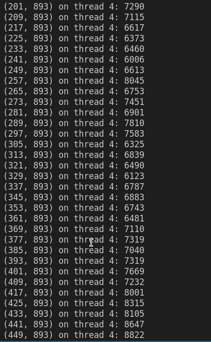
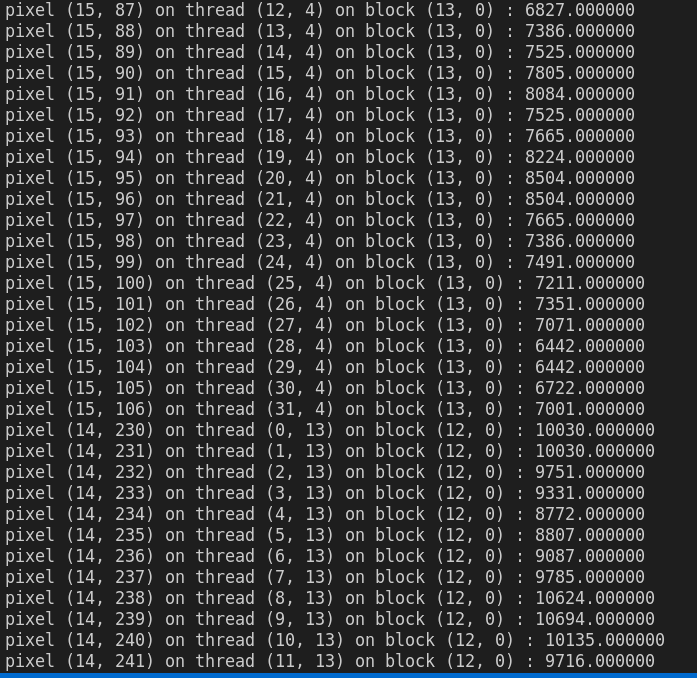

# cuda-gnu

### Running a sample [multi-thread program](https://www.gnu.org/software//gnuastro/manual/html_node/Library-demo-_002d-multi_002dthreaded-operation.html) using builtin multithreading and its equivalent using Cuda

- CPU multithreading

Make sure you've [GnuAstro](https://www.gnu.org/software//gnuastro/manual/html_node/Installation.html) and its dependencies installed.

`gcc parallel.c -o parallelcpu -lgnuastro`

`./parallelcpu`

clipped output :

- Cuda multithreading

Make sure you've [GnuAstro](https://www.gnu.org/software//gnuastro/manual/html_node/Installation.html) and its dependencies, as well as [cuda-toolkit](https://docs.nvidia.com/cuda/cuda-installation-guide-linux/index.html) installed

`nvcc parallel.cu -o parallelgpu -lgnuastro`

`./parallelgpu`

clipped output : 

